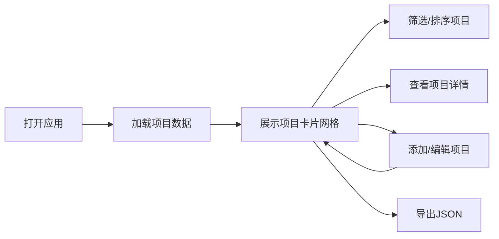

## 1. 产品概述

设计师/开发者个人作品集展示工具，帮助用户管理和展示个人项目作品。支持项目卡片管理、类型筛选、状态标记、时间线展示、主题切换、拖拽排序和 JSON 导出功能。

- 目标用户：设计师、前端开发者、创意工作者
- 核心价值：一站式作品集管理与展示，提升个人品牌形象

## 2. 核心特性

### 2.1 用户角色
| 角色 | 注册方式 | 核心权限 |
|------|----------|----------|
| 用户 | 本地使用 | 项目管理、筛选、排序、导出 |

### 2.2 功能模块
1. **项目看板**：项目卡片网格展示、封面图、基本信息
2. **项目管理**：添加/编辑/删除项目卡片、项目详情弹窗
3. **筛选系统**：按项目类型筛选（UI设计、Web开发、插画等）
4. **状态系统**：项目状态标记（进行中/已完成/已归档）、进度条
5. **时间线**：项目关键里程碑时间线展示
6. **主题系统**：暗色/亮色主题切换
7. **排序系统**：手动拖拽排序、按日期排序
8. **导出功能**：导出项目列表为 JSON 格式

### 2.3 页面详情
| 页面名称 | 模块名称 | 功能描述 |
|---------|----------|----------|
| 主页面 | 顶部导航栏 | Logo、主题切换按钮、添加项目按钮、筛选器、排序选择、导出按钮 |
| 主页面 | 项目卡片网格 | 响应式网格布局、项目卡片悬停效果、状态标签、进度条 |
| 主页面 | 项目详情弹窗 | 项目完整信息、技术栈标签、时间线、项目链接 |
| 主页面 | 添加/编辑表单 | 表单输入、封面图上传、类型选择、状态设置、里程碑管理 |

## 3. 核心流程

用户打开应用 → 浏览项目卡片列表 → 使用筛选器/排序查看特定项目 → 点击项目查看详情 → 添加/编辑项目 → 导出项目数据

## 4. 用户界面设计

### 4.1 设计风格
- 主色调：深蓝灰色系，搭配鲜明的强调色（青色/琥珀色）
- 卡片风格：圆角卡片，微妙阴影，悬停时上浮效果
- 字体：现代无衬线字体，标题粗体，正文清晰易读
- 布局风格：卡片式网格布局，顶部固定导航栏
- 图标风格：线性简约图标

### 4.2 页面设计概述
| 页面名称 | 模块名称 | UI元素 |
|---------|----------|--------|
| 主页面 | 顶部导航栏 | 渐变背景、Logo、筛选标签、排序下拉、主题切换、添加按钮 |
| 主页面 | 项目卡片 | 封面图、状态徽章、项目名称、类型标签、描述、技术栈、进度条 |
| 主页面 | 详情弹窗 | 模糊背景、大图展示、项目信息、时间线、操作按钮 |
| 主页面 | 表单弹窗 | 分组表单、文件上传、动态里程碑添加 |

### 4.3 响应式设计
- 桌面端：3-4列卡片网格，侧边筛选
- 平板端：2列卡片网格
- 移动端：1列卡片，底部操作栏

### 4.4 动效设计
- 页面加载：卡片交错淡入动画
- 悬停效果：卡片轻微上浮 + 阴影加深
- 主题切换：平滑颜色过渡
- 弹窗：缩放 + 淡入效果
- 拖拽排序：位置平滑过渡
