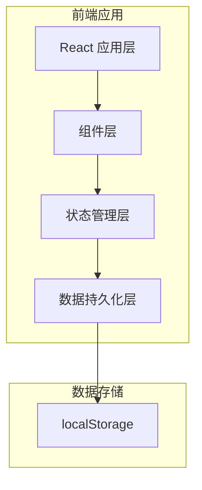
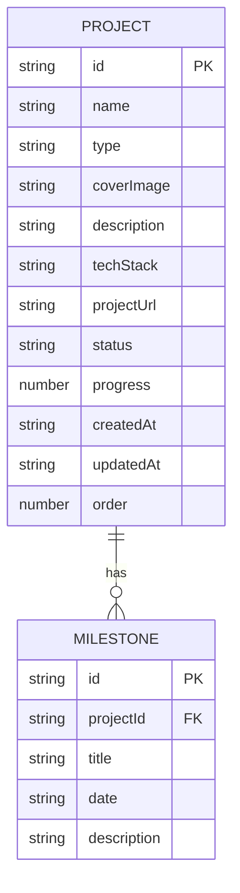

## 1. 架构设计



## 2. 技术栈说明

- **前端框架**：React 18 + TypeScript
- **构建工具**：Vite
- **样式方案**：TailwindCSS 3
- **状态管理**：React Context + useReducer
- **拖拽排序**：@dnd-kit/core + @dnd-kit/sortable
- **图标库**：lucide-react
- **数据持久化**：localStorage
- **动画效果**：CSS Transitions + Framer Motion

## 3. 项目结构

```
src/
├── components/
│   ├── Header/           # 顶部导航栏
│   ├── ProjectCard/      # 项目卡片
│   ├── ProjectGrid/      # 项目网格
│   ├── ProjectModal/     # 项目详情弹窗
│   ├── ProjectForm/      # 项目表单弹窗
│   ├── FilterBar/        # 筛选栏
│   ├── Timeline/         # 时间线组件
│   ├── ThemeToggle/      # 主题切换
│   └── ProgressBar/      # 进度条
├── context/
│   ├── ProjectContext.tsx    # 项目状态管理
│   └── ThemeContext.tsx      # 主题状态管理
├── types/
│   └── index.ts              # 类型定义
├── data/
│   └── mockProjects.ts       # 示例项目数据
├── hooks/
│   └── useLocalStorage.ts    # localStorage Hook
├── utils/
│   └── export.ts             # 导出工具函数
├── App.tsx
├── main.tsx
└── index.css
```

## 4. 类型定义

```typescript
type ProjectStatus = 'in-progress' | 'completed' | 'archived';
type ProjectType = 'ui-design' | 'web-development' | 'illustration' | 'other';

interface Milestone {
  id: string;
  title: string;
  date: string;
  description: string;
}

interface Project {
  id: string;
  name: string;
  type: ProjectType;
  coverImage: string;
  description: string;
  techStack: string[];
  projectUrl: string;
  status: ProjectStatus;
  progress: number;
  milestones: Milestone[];
  createdAt: string;
  updatedAt: string;
  order: number;
}

type SortType = 'manual' | 'date-desc' | 'date-asc' | 'name';
```

## 5. 核心功能实现方案

### 5.1 项目状态管理
- 使用 React Context 管理全局项目状态
- 使用 useReducer 处理复杂状态更新
- 使用 useLocalStorage 自定义 Hook 持久化数据

### 5.2 拖拽排序
- 使用 @dnd-kit 实现拖拽功能
- 拖拽结束后更新项目 order 字段
- 手动排序模式下按 order 字段排序

### 5.3 主题切换
- 使用 CSS 变量实现主题切换
- 数据属性 `data-theme` 控制主题
- 支持亮色/暗色两种主题
- 主题偏好存储到 localStorage

### 5.4 筛选与排序
- 类型筛选：根据 type 字段过滤
- 状态筛选：根据 status 字段过滤
- 排序支持：手动、日期升降序、名称排序

### 5.5 JSON 导出
- 将项目数据转换为 JSON 字符串
- 创建 Blob 对象并触发下载
- 文件名包含当前日期

## 6. 数据模型

### 6.1 数据模型关系


